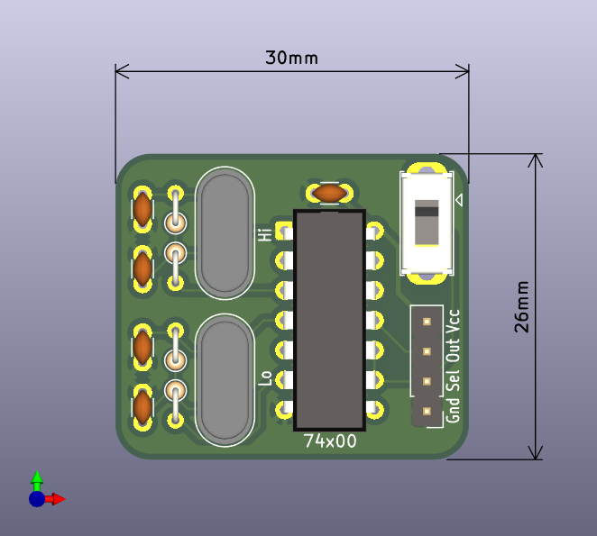
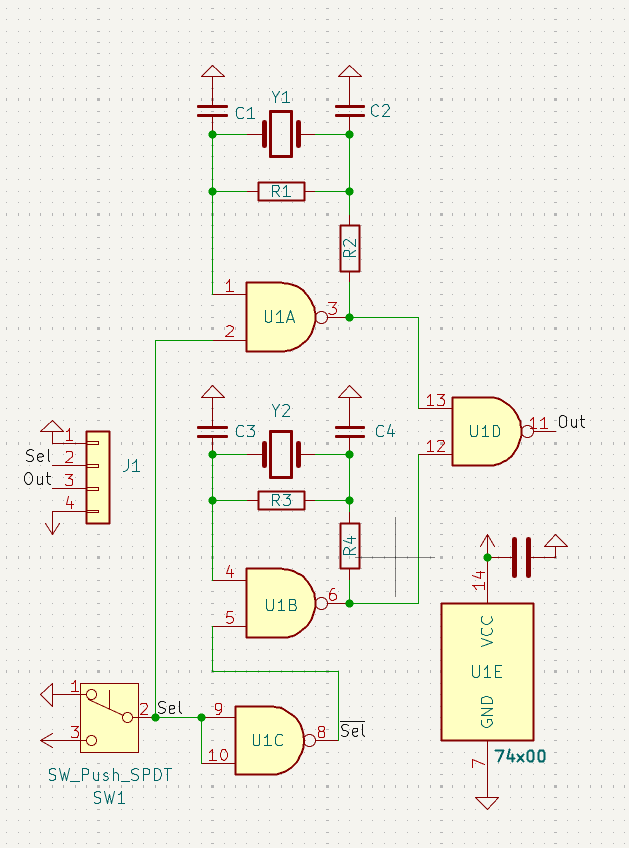

# Retro Clock Selector

This is a very simple universal mod board for retro systems, that selects between one of two clocks sources, for example, to select between PAL and NTSC clocks.

This board uses only a single 74-series IC (74HCT00) and generic through-hole passive components.

> This is a generic board, **there are no instructions nor warranty provided**, ideal component values and installation will vary depending on the particular system this board is installed in, **please carefully read the schematics for both this board and your system, and analyze how this pertains to your use case**.

## Theory of Operation

This board connects to a system through 4 wires: Power (Vcc), Ground (Gnd), Clock Output (Out) and Clock Select (Sel).

The Sel wire selects which of the two **pierce oscilator circuits** (Hi or Lo) is currently active, and is typically driven by the switch on the modboard. On many sega systems, for example, the Hi oscillator would be NTSC and Lo would be PAL.

